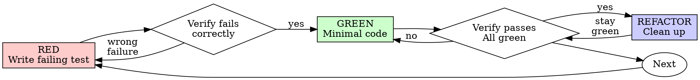

# Test-Driven Development (TDD)

## 🎯 Quick Reference

**The Cycle**: RED (write failing test) → Verify fails → GREEN (minimal code) → Verify passes → REFACTOR → Repeat

**The Iron Law**: No production code without a failing test first

**If you wrote code before the test**: Delete it. Start over. No exceptions.

**First step**: Investigate the codebase to discover test framework, patterns, and commands before writing tests.

**Test data cleanup**: ALWAYS clean up test data. No test pollution. Verify database is clean after tests run.

---

## Overview

Write the test first. Watch it fail. Write minimal code to pass.

**Core principle:** If you didn't watch the test fail, you don't know if it tests the right thing.

**Violating the letter of the rules is violating the spirit of the rules.**

## When to Use

**Always:**
- New features
- Bug fixes
- Refactoring
- Behavior changes

**Exceptions (ask your human partner):**
- Throwaway prototypes
- Generated code
- Configuration files

Thinking "skip TDD just this once"? Stop. That's rationalization.

## The Iron Law

```
NO PRODUCTION CODE WITHOUT A FAILING TEST FIRST
```

Write code before the test? Delete it. Start over.

**No exceptions:**
- Don't keep it as "reference"
- Don't "adapt" it while writing tests
- Don't look at it
- Delete means delete

Implement fresh from tests. Period.

## Red-Green-Refactor



### RED - Write Failing Test

Write one minimal test showing what should happen.

<Good>
```typescript
test('retries failed operations 3 times', async () => {
  let attempts = 0;
  const operation = () => {
    attempts++;
    if (attempts < 3) throw new Error('fail');
    return 'success';
  };

  const result = await retryOperation(operation);

  expect(result).toBe('success');
  expect(attempts).toBe(3);
});
```
Clear name, tests real behavior, one thing
</Good>

<Bad>
```typescript
test('retry works', async () => {
  const mock = jest.fn()
    .mockRejectedValueOnce(new Error())
    .mockRejectedValueOnce(new Error())
    .mockResolvedValueOnce('success');
  await retryOperation(mock);
  expect(mock).toHaveBeenCalledTimes(3);
});
```
Vague name, tests mock not code
</Bad>

**Requirements:**
- One behavior
- Clear name
- Real code (no mocks unless unavoidable)

### Verify RED - Watch It Fail

**MANDATORY. Never skip.**

```bash
npm test path/to/test.test.ts
```

Confirm:
- Test fails (not errors)
- Failure message is expected
- Fails because feature missing (not typos)

**Test passes?** You're testing existing behavior. Fix test.

**Test errors?** Fix error, re-run until it fails correctly.

### GREEN - Minimal Code

Write simplest code to pass the test.

<Good>
```typescript
async function retryOperation<T>(fn: () => Promise<T>): Promise<T> {
  for (let i = 0; i < 3; i++) {
    try {
      return await fn();
    } catch (e) {
      if (i === 2) throw e;
    }
  }
  throw new Error('unreachable');
}
```
Just enough to pass
</Good>

<Bad>
```typescript
async function retryOperation<T>(
  fn: () => Promise<T>,
  options?: {
    maxRetries?: number;
    backoff?: 'linear' | 'exponential';
    onRetry?: (attempt: number) => void;
  }
): Promise<T> {
  // YAGNI
}
```
Over-engineered
</Bad>

Don't add features, refactor other code, or "improve" beyond the test.

### Verify GREEN - Watch It Pass

**MANDATORY.**

```bash
npm test path/to/test.test.ts
```

Confirm:
- Test passes
- Other tests still pass
- Output pristine (no errors, warnings)

**Test fails?** Fix code, not test.

**Other tests fail?** Fix now.

### REFACTOR - Clean Up

After green only:
- Remove duplication
- Improve names
- Extract helpers

Keep tests green. Don't add behavior.

### Repeat

Next failing test for next feature.

## Good Tests

| Quality | Good | Bad |
|---------|------|-----|
| **Minimal** | One thing. "and" in name? Split it. | `test('validates email and domain and whitespace')` |
| **Clear** | Name describes behavior | `test('test1')` |
| **Shows intent** | Demonstrates desired API | Obscures what code should do |

## Why Order Matters

**"I'll write tests after to verify it works"**

Tests written after code pass immediately. Passing immediately proves nothing:
- Might test wrong thing
- Might test implementation, not behavior
- Might miss edge cases you forgot
- You never saw it catch the bug

Test-first forces you to see the test fail, proving it actually tests something.

**"I already manually tested all the edge cases"**

Manual testing is ad-hoc. You think you tested everything but:
- No record of what you tested
- Can't re-run when code changes
- Easy to forget cases under pressure
- "It worked when I tried it" ≠ comprehensive

Automated tests are systematic. They run the same way every time.

**"Deleting X hours of work is wasteful"**

Sunk cost fallacy. The time is already gone. Your choice now:
- Delete and rewrite with TDD (X more hours, high confidence)
- Keep it and add tests after (30 min, low confidence, likely bugs)

The "waste" is keeping code you can't trust. Working code without real tests is technical debt.

**"TDD is dogmatic, being pragmatic means adapting"**

TDD IS pragmatic:
- Finds bugs before commit (faster than debugging after)
- Prevents regressions (tests catch breaks immediately)
- Documents behavior (tests show how to use code)
- Enables refactoring (change freely, tests catch breaks)

"Pragmatic" shortcuts = debugging in production = slower.

**"Tests after achieve the same goals - it's spirit not ritual"**

No. Tests-after answer "What does this do?" Tests-first answer "What should this do?"

Tests-after are biased by your implementation. You test what you built, not what's required. You verify remembered edge cases, not discovered ones.

Tests-first force edge case discovery before implementing. Tests-after verify you remembered everything (you didn't).

30 minutes of tests after ≠ TDD. You get coverage, lose proof tests work.

## Common Rationalizations

| Excuse | Reality |
|--------|---------|
| "Too simple to test" | Simple code breaks. Test takes 30 seconds. |
| "I'll test after" | Tests passing immediately prove nothing. |
| "Tests after achieve same goals" | Tests-after = "what does this do?" Tests-first = "what should this do?" |
| "Already manually tested" | Ad-hoc ≠ systematic. No record, can't re-run. |
| "Deleting X hours is wasteful" | Sunk cost fallacy. Keeping unverified code is technical debt. |
| "Keep as reference, write tests first" | You'll adapt it. That's testing after. Delete means delete. |
| "Need to explore first" | Fine. Throw away exploration, start with TDD. |
| "Test hard = design unclear" | Listen to test. Hard to test = hard to use. |
| "TDD will slow me down" | TDD faster than debugging. Pragmatic = test-first. |
| "Manual test faster" | Manual doesn't prove edge cases. You'll re-test every change. |
| "Existing code has no tests" | You're improving it. Add tests for existing code. |

## Red Flags - STOP and Start Over

- Code before test
- Test after implementation
- Test passes immediately
- Can't explain why test failed
- Tests added "later"
- Rationalizing "just this once"
- "I already manually tested it"
- "Tests after achieve the same purpose"
- "It's about spirit not ritual"
- "Keep as reference" or "adapt existing code"
- "Already spent X hours, deleting is wasteful"
- "TDD is dogmatic, I'm being pragmatic"
- "This is different because..."

**All of these mean: Delete code. Start over with TDD.**

## Example: Bug Fix

**Bug:** Empty email accepted

**RED**
```typescript
test('rejects empty email', async () => {
  const result = await submitForm({ email: '' });
  expect(result.error).toBe('Email required');
});
```

**Verify RED**
```bash
$ npm test
FAIL: expected 'Email required', got undefined
```

**GREEN**
```typescript
function submitForm(data: FormData) {
  if (!data.email?.trim()) {
    return { error: 'Email required' };
  }
  // ...
}
```

**Verify GREEN**
```bash
$ npm test
PASS
```

**REFACTOR**
Extract validation for multiple fields if needed.

## Verification Checklist

Before marking work complete:

- [ ] Every new function/method has a test
- [ ] Watched each test fail before implementing
- [ ] Each test failed for expected reason (feature missing, not typo)
- [ ] Wrote minimal code to pass each test
- [ ] All tests pass
- [ ] Output pristine (no errors, warnings)
- [ ] Tests use real code (mocks only if unavoidable)
- [ ] Edge cases and errors covered
- [ ] Test data cleanup implemented (transactions, teardown hooks, or cleanup scripts)
- [ ] Verified database is clean after tests (no test pollution)
- [ ] Tests can run multiple times without manual cleanup

**Additional for Supabase Auth features:**
- [ ] Tenant isolation tested (cross-tenant access blocked by RLS)
- [ ] JWT claims tested (tenant_id in access token)
- [ ] Data Access Layer tested (requireAuth() pattern)
- [ ] Database triggers tested (public.users created from auth.users)
- [ ] Auth test users cleaned up (using admin client)
- [ ] Followed patterns from `docs/architecture/auth-best-practices.md`

Can't check all boxes? You skipped TDD. Start over.

## Adapting TDD to Your Codebase

**BEFORE writing any tests, investigate:**

1. **Find existing tests** - Look for test files (`**/*.test.ts`, `**/*.spec.js`, `tests/`, `__tests__/`)
2. **Identify test framework** - Jest, Vitest, Mocha, pytest, JUnit, xUnit, etc.
3. **Discover test patterns** - How are existing tests structured? What helpers/fixtures exist?
4. **Understand tech stack** - Database (Postgres, MongoDB, etc.), API framework (Express, FastAPI, ASP.NET), dependencies
5. **Check documentation** - Look for CLAUDE.md, README.md, or docs/ for testing instructions

**Then apply TDD using discovered patterns.**

### Technology-Specific Adaptations

#### Supabase Authentication (CRITICAL for impactOS)

**Reference**: `docs/architecture/auth-best-practices.md` for architectural patterns

**Test authentication BEFORE implementing auth features. No exceptions.**

**Required Test Categories for Auth:**

1. **Tenant Isolation Tests** (HIGHEST PRIORITY)
```typescript
// RED - Write this test first
test('RLS prevents cross-tenant data access', async () => {
  // Create two users in different tenants
  const user1 = await createTestUser({
    email: 'user1@test.com',
    tenant_id: TENANT_1_ID
  })
  const user2 = await createTestUser({
    email: 'user2@test.com',
    tenant_id: TENANT_2_ID
  })

  // User 1 creates a company
  const company = await createCompanyAs(user1, {
    business_name: 'Test Co'
  })

  // User 2 tries to access it - should fail
  const result = await getCompanyAs(user2, company.id)

  expect(result).toBeNull()
})

// GREEN - Implement RLS policies to make test pass
// Verify test FAILED before RLS policies existed
```

2. **JWT Claims Tests**
```typescript
// RED - Write this test first
test('JWT contains tenant_id claim after login', async () => {
  const user = await signUp({
    email: 'test@example.com',
    password: 'password',
    metadata: { tenant_id: TENANT_1_ID }
  })

  const session = await signIn({
    email: 'test@example.com',
    password: 'password'
  })

  const jwt = decodeJwt(session.access_token)
  expect(jwt.tenant_id).toBe(TENANT_1_ID)
})

// GREEN - Implement Custom Access Token Hook
// Verify test FAILED before hook was created
```

3. **Data Access Layer Tests**
```typescript
// RED - Write this test first
test('DAL requireAuth() throws for unauthenticated requests', async () => {
  // No auth setup
  await expect(getCompanies()).rejects.toThrow('Unauthorized')
})

test('DAL returns data for authenticated user', async () => {
  const user = await createAuthenticatedUser()
  const companies = await getCompanies() // Uses DAL
  expect(companies).toBeDefined()
})

// GREEN - Implement DAL pattern from auth-best-practices.md
```

4. **Database Trigger Tests**
```typescript
// RED - Write this test first
test('signing up creates public.users record with tenant_id', async () => {
  const { user } = await supabase.auth.signUp({
    email: 'test@example.com',
    password: 'password',
    options: {
      data: {
        tenant_id: TENANT_1_ID,
        first_name: 'John',
        last_name: 'Doe'
      }
    }
  })

  // Check public.users table (not auth.users)
  const { data } = await supabase
    .from('users')
    .select('tenant_id, first_name, last_name')
    .eq('id', user.id)
    .single()

  expect(data.tenant_id).toBe(TENANT_1_ID)
  expect(data.first_name).toBe('John')
})

// GREEN - Implement handle_new_user() trigger
```

**Supabase Auth Test Data Cleanup:**

```typescript
// ALWAYS clean up auth.users and public.users
afterEach(async () => {
  // Delete test users
  for (const userId of testUserIds) {
    await adminClient.auth.admin.deleteUser(userId)
    // Cascade deletes public.users via FK
  }
  testUserIds.clear()
})

// Track test users
const testUserIds = new Set<string>()

async function createTestUser(data) {
  const { data: { user } } = await supabase.auth.signUp(data)
  testUserIds.add(user.id) // Track for cleanup
  return user
}
```

**Common Supabase Auth Testing Mistakes:**

❌ **Using real Supabase client in tests without cleanup**
```typescript
// BAD - Leaves users in auth.users table
test('creates user', async () => {
  await supabase.auth.signUp({ email: 'test@example.com', password: '123' })
  // No cleanup!
})
```

✅ **Using admin client for cleanup**
```typescript
// GOOD - Cleans up after test
const adminClient = createClient(URL, SERVICE_ROLE_KEY)

afterEach(async () => {
  for (const userId of testUserIds) {
    await adminClient.auth.admin.deleteUser(userId)
  }
})
```

❌ **Not testing RLS policies**
```typescript
// BAD - Tests application logic but not database security
test('getCompanies returns companies', async () => {
  const companies = await getCompanies()
  expect(companies).toBeDefined()
})
```

✅ **Testing RLS enforcement**
```typescript
// GOOD - Verifies RLS blocks cross-tenant access
test('RLS prevents unauthorized access', async () => {
  const user1Company = await createCompanyAs(user1, {})
  const result = await getCompanyAs(user2, user1Company.id)
  expect(result).toBeNull() // RLS blocked it
})
```

**TDD Cycle for Auth Features:**

1. **RED**: Write test for tenant isolation FIRST
2. **Verify RED**: Confirm test fails (users CAN access other tenant's data)
3. **GREEN**: Add RLS policy to block access
4. **Verify GREEN**: Test passes (users CANNOT access other tenant's data)
5. **REFACTOR**: Clean up policy, add comments

**Key Principle**: If you didn't see the test fail when RLS was missing, you don't know the test actually validates tenant isolation.

#### Databases
- **With test database**: Use real database for integration tests (tests triggers, constraints, RLS)
- **With in-memory database**: Prefer in-memory for speed (SQLite, H2)
- **Without test database**: Mock database calls, but note you're not testing database behavior
- **Transactions**: Wrap tests in transactions and rollback for isolation

**Key question**: Does the database have triggers, constraints, or row-level security? If yes, strongly prefer real database tests.

**CRITICAL: Test Data Cleanup**

Tests MUST NOT pollute the database. Choose cleanup strategy based on your test framework:

**Strategy 1: Transactions (Preferred)**
```typescript
// Wrap each test in transaction, rollback after
beforeEach(async () => {
  await db.beginTransaction();
});

afterEach(async () => {
  await db.rollback();
});
```
✅ Automatic, fast, foolproof
❌ Doesn't work if code commits transactions

**Strategy 2: Teardown Hooks**
```typescript
// Delete test data after each test
const testData: TestRecord[] = [];

afterEach(async () => {
  for (const record of testData) {
    await db.delete(record.table, record.id);
  }
  testData.length = 0;
});

test('creates user', async () => {
  const user = await createUser({ email: 'test@example.com' });
  testData.push({ table: 'users', id: user.id });
  expect(user).toBeDefined();
});
```
✅ Works with committed transactions
❌ Manual tracking required

**Strategy 3: Cleanup Scripts**
```typescript
// Run cleanup command after test suite
afterAll(async () => {
  await exec('npm run cleanup:all-test-data');
});
```
✅ Handles complex relationships, project-specific logic
❌ Slower, requires maintenance

**Verification**
```typescript
// Verify database is clean
afterAll(async () => {
  const testRecords = await db.query(
    "SELECT * FROM users WHERE email LIKE '%@test.example.com'"
  );
  expect(testRecords).toHaveLength(0);
});
```

**Rules:**
1. NEVER leave test data in database
2. Use unique identifiers (UUIDs, timestamps) to distinguish test data
3. Check for cleanup scripts in package.json (`cleanup:test-data`, `test:cleanup`)
4. Verify cleanup worked (query for test data after suite)
5. If tests fail mid-run, cleanup should still run (use try/finally)

**Red flags:**
- Finding yesterday's test data in database
- Tests fail when run twice
- "Works on my machine" (stale test data)
- Manual database cleanup between test runs

#### API Routes/Endpoints
- Test the full request/response cycle when possible
- Use framework-specific test clients (supertest, httptest, TestClient)
- Verify status codes, headers, response body
- Test error cases (validation failures, auth errors, not found)

#### External Services (APIs, Payment Processors, Email)
- **Always mock** - External services cost money, have rate limits, or cause side effects
- Use recorded responses (VCR, Polly.js) for realistic fixtures
- Test error handling (timeouts, 500 errors, API changes)

#### Async Operations
- Test actual async behavior, don't just await and assume it works
- Test race conditions, timeouts, retries
- Verify side effects occur in correct order

#### React/UI Components
- Test behavior, not implementation
- User interactions → expected output
- Prefer integration tests over unit tests for components
- Use Testing Library patterns (user-centric queries)

### Discovering Test Commands

Look in `package.json` scripts:
```json
{
  "scripts": {
    "test": "...",                    // Run this
    "test:watch": "...",              // Or this for TDD
    "test:unit": "...",
    "test:integration": "...",
    "cleanup:test-data": "...",       // Check for cleanup scripts
    "cleanup:all-test-data": "...",   // Or variants like this
    "test:cleanup": "..."
  }
}
```

Common patterns:
- Node: `npm test`, `npm run test:watch`
- Python: `pytest`, `pytest -v`
- .NET: `dotnet test`
- Java: `mvn test`, `gradle test`

**Look for cleanup commands**: `cleanup:test-data`, `test:cleanup`, `db:test:clean`. Use these in `afterAll()` hooks or run manually if tests leave data.

### Mocking Strategy by Discovery

**Investigate what to mock:**
1. **Never mock**: Pure functions, business logic, utilities
2. **Prefer real**: Databases (with test DB), file system (with temp dirs), in-process dependencies
3. **Always mock**: HTTP APIs, email services, payment processors, time-dependent code (use fake timers)
4. **Context-dependent**: ORMs (real for integration, mock for unit), caches (real if fast, mock if network)

**Check project conventions**: If existing tests use real database, follow that pattern. If they mock everything, follow that (but question it).

### Common Architecture Patterns

**Service layer pattern**: Test services with real dependencies when possible, test controllers/routes with mocked services

**Repository pattern**: Test repositories with real database, test business logic with mocked repositories

**Hexagonal/Clean architecture**: Test domain logic (core) with no mocks, test adapters (infrastructure) with real external systems

## When Stuck

| Problem | Solution |
|---------|----------|
| Don't know how to test | Write wished-for API. Write assertion first. Investigate similar tests. Ask your human partner. |
| Test too complicated | Design too complicated. Simplify interface. |
| Must mock everything | Code too coupled. Use dependency injection. |
| Test setup huge | Extract test helpers/fixtures. Still complex? Simplify design. |
| Testing database operations | Investigate if project has test database setup. Look for existing database test patterns. Prefer real database over mocks. Implement cleanup strategy (transactions, teardown, or scripts). |
| Test data pollution | Tests leave data in database. Implement cleanup: transactions with rollback, afterEach/afterAll hooks, or cleanup scripts. Verify database clean after tests. |
| Testing async code | Use framework's async testing utilities. Don't just await - test actual behavior. Check existing async tests for patterns. |
| Testing API routes | Investigate framework test client (supertest, etc.). Find existing API tests to follow. Test full request/response cycle. |
| Testing with external APIs | Always mock. Look for existing mocking patterns (nock, MSW, VCR). Test error cases. |
| Legacy code without tests | Add tests for new behavior first. Consider characterization tests for existing behavior. Follow TDD for all new code. |
| Framework-specific testing | Search codebase for existing tests. Check framework docs for testing best practices. Look for test setup/teardown patterns. |
| Performance/integration tests | These complement TDD, don't replace it. Unit tests first (fast feedback), integration tests verify end-to-end. |

## Debugging Integration

Bug found? Write failing test reproducing it. Follow TDD cycle. Test proves fix and prevents regression.

Never fix bugs without a test.

## Final Rule

```
Production code → test exists and failed first
Otherwise → not TDD
```

No exceptions without your human partner's permission.
